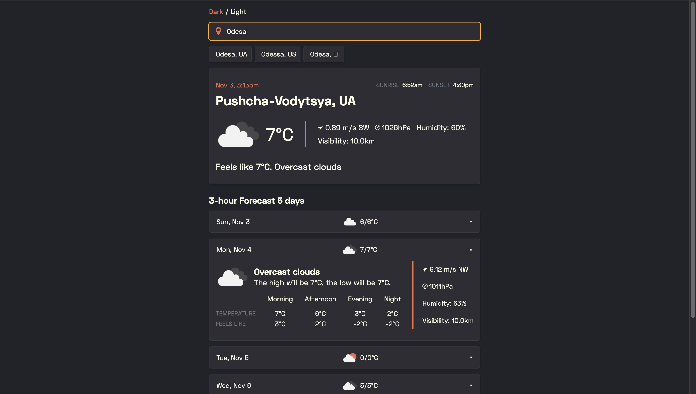

# Weather App
<p>
  
  
  
  
  
</p>

**Weather App** is a web application that utilizes the Open Weather API to provide users with current weather conditions and forecasts. Users can search for their desired city in the search field, where they can view the current weather along with a five-day weather forecast. The app supports both dark and light themes, allowing for a customizable user experience. The last searched city and selected theme are stored in local storage, ensuring that preferences persist even after a page refresh.

Please note that the free version of the Open Weather API may sometimes return the name of the city, while at other times it may return the name of a district or area. For example, searching for Kyiv might return “Pushcha-Vodytsya” whereas searching for Paris might return “Palais-Royal.”

You can view the live demo of the project at: [Weather App on Netlify](https://wweatherr-app.netlify.app)



### Key Features:
- Search for and view current weather conditions and forecasts for specific cities
- Five-day weather forecast display
- Support for dark and light themes
- Last searched city and theme saved in local storage for persistence
- User-friendly interface with real-time weather updates

Data is provided by the Open Weather API, delivering reliable weather information.

## Installation

To run the project locally, follow these steps:

1. **Clone the repository**:
   ```bash
   git clone https://github.com/VanyaLyashuk/weather-app.git
   cd weather-app
2. **Create a** .env **file** in the project root with the following content:
	```bash
   OPEN_WEATHER_API_KEY="your_api_key_here"
**Note**: You can obtain a free API key from the [OpenWeather API](https://openweathermap.org/api).

3. **Install dependencies and Netlify CLI**:	
	```bash
	npm install
	npm install -g netlify-cli
4. **Start the application**  using Netlify:	
	```bash
	netlify dev
The project will be available at http://localhost:8888.

**Note**: Netlify CLI allows you to run the project locally with serverless functions as they would work on deployment.

## License

This project is licensed under the MIT License. See the [LICENSE](https://opensource.org/licenses/MIT) file for more information.
